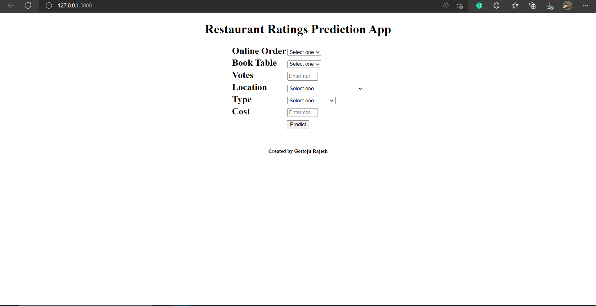

# Restaurant Rating Prediction

# Objective

The main goal of this project is to perform extensive Exploratory Data Analysis(EDA) on 
the Zomato Dataset and build an appropriate Machine Learning Model that will help 
various Zomato Restaurants to predict their respective Ratings based on certain 
features.

[You can reach the application here] 
[https://restaurantratingpredictionapp.herokuapp.com/](https://restaurant-prediction-rating.herokuapp.com/)

# Problem statement
The basic idea of analyzing the Zomato dataset is to get a fair idea about the factors affecting the establishment
of different types of restaurant at different places in Bengaluru, aggregate rating of each restaurant, Bengaluru
being one such city has more than 12,000 restaurants with restaurants serving dishes from all over the world.
With each day new restaurants opening the industry has’nt been saturated yet and the demand is increasing
day by day. Inspite of increasing demand it however has become difficult for new restaurants to compete with
established restaurants. Most of them serving the same food. Bengaluru being an IT capital of India. Most of
the people here are dependent mainly on the restaurant food as they don’t have time to cook for themselves.
With such an overwhelming demand of restaurants it has therefore become important to study the demography
of a location. What kind of a food is more popular in a locality. Do the entire locality loves vegetarian food.
If yes then is that locality populated by a particular sect of people for eg. Jain, Marwaris, Gujaratis who are
mostly vegetarian. These kind of analysis can be done using the data, by studying the factors such as

Feature description :

1. url contains the url of the restaurant in the zomato website

2. address contains the address of the restaurant in Bengaluru

3. name contains the name of the restaurant

4. online_order whether online ordering is available in the restaurant or not

5. book_table table book option available or not

6. rate contains the overall rating of the restaurant out of 5

7. votes contains total number of rating for the restaurant as of the above mentioned date

8. phone contains the phone number of the restaurant

9. location contains the neighborhood in which the restaurant is located

10. rest_type restaurant type

11. dish_liked dishes people liked in the restaurant

12. cuisines food styles, separated by comma

13. approx_cost(for two people) contains the approximate cost of meal for two people

14. reviews_list list of tuples containing reviews for the restaurant, each tuple

15. menu_item contains list of menus available in the restaurant

16. listed_in(type) type of meal

17. listed_in(city) contains the neighborhood in which the restaurant is listed

# Steps to involved in model building
- Data Loading
- Data transformation
- Data transformation
- New feature Generation
- Feature Engineering
- Model Building
- Evaluting Model
- Flask setup
- Push to Github
- deploying

# Snippets of Project

1)Webapp Home page

Conclusion :

* From the analysis, 'Onesta', 'Empire Restaurant' & 'KFC' are the most famous restaurants in bangalore.

* Most Restaurants offer options for online order and delivery.

* Most restaurants don't offer table booking.

* From the analysis, most of the ratings are within 3.5 and 4.5.

* From the analysis. we can see that most of the restaurants located in 'Koramangala 5th Block', 'BTM' & 'Indiranagar'.Then least      restaurants are located 'KR Puram', 'Kanakapura', 'Magadi Road'.

* 'Casual Dining', 'Quick Bites', 'Cafe', 'Dessert Parlor' are the most common types of restaurant.And 'Food Court', 'Casual Dining', 'Dhaba' are the least common.

* From the analysis, pasta & Pizza most famous food in bangalore restaurants.

* From the analysis, we can see that North Indian Cuisines are most famous in bangalore restaurants.

* Two main service types are Delivery and Dine-out.

* From the analysis, we can see that 'Onesta', 'Truffles' & 'Empire Restaurant' are highly voted restaurants.

For the modeling part, i used LinearRegression, DecisionTree Regressor, RandomForest Regressor , Supprotvector Regressor & ExtraTree Regressor. From all these models ExtraTree Regressor perform well compared to the other models.So i selected ExtraTree Regressor for model creation.

